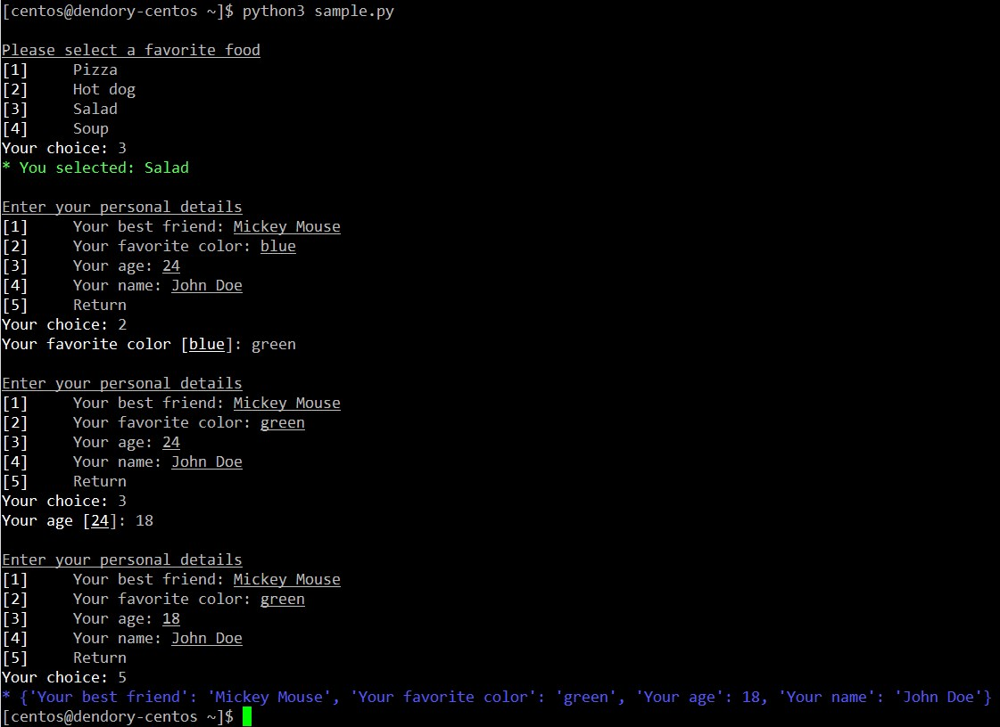

# Menu3
Menu3 is a simple Python 3.x command line menu system. It can create simple menus and return the value selected by the user. It supports default values, multiple choices, and colors (Linux only).

## Example:

## Installation:

    pip install menu3

## Usage:

Import the module

    import menu3

Create the menu (True allows the user to quit the app with 'q', False does not allow quiting)

    m = menu3.Menu(True)

Ask the user for favorite food, providing the menu title, the list of choices, and optionally the user prompt

    food = ["Pizza", "Hot dog", "Salad", "Soup"]
    c = m.menu("Please select a favorite food", food, "Your choice, 'q' to quit:")

Print the food selected using a success message (you can also use 'fail', 'warn' and 'info' to get different colors)

    m.success("You selected: " + food[c-1])

Create a dict of choices and default values then show a configuration menu, and update the choices

    cfg = {'Your name': "John Doe", 'Your age': 24, 'Your favorite color': "blue", 'Your best friend': "Mickey Mouse"}
    cfg = m.config_menu("Enter your personal details", cfg)

Show an info message with the new values

    m.info(str(cfg))
